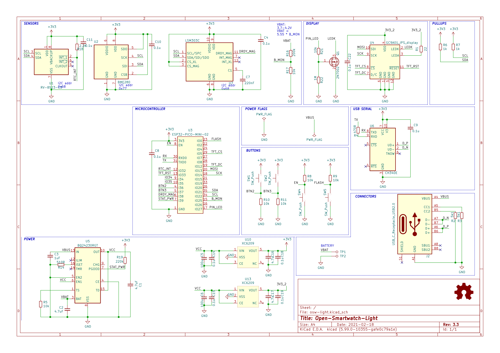

# Open-Smartwatch KiCAD files, Electro707's Fork

Repo Electro707's fork of the Open-Smartwatch project. You should be in the `e707` branch.

## My Changes
Here are some changes that I plan on doing to this design:
- Replace the battery charger and power mux combo with an integrated PowerPath TI charger IC (BQ24230RGT)
- Replace the module with an ESP32-PICO-MINI-02
- Replace the connector with a TypeC
- Replace the RTC with a smaller package one (RV-8523-C3)
- (Maybe) Add a QI charger

## Tools

To view/modify the files from this repository, install KiCAD from: [https://kicad.org](https://kicad.org). 
__Must use the nightly version of KiCAD__

Also, add the following Symbol/Footprint library to KiCAD: [https://github.com/Open-Smartwatch/Kicad-Libraries](https://github.com/Open-Smartwatch/Kicad-Libraries)

## Schematic (May not be updated to this version)

## Plots (May not be updated to this version)

## BOM (May not be updated to this version)

See: [https://htmlpreview.github.io/?https://github.com/Open-Smartwatch/open-smartwatch-light/blob/main/docs/bom/osw-light-ibom.html](https://htmlpreview.github.io/?https://github.com/Open-Smartwatch/open-smartwatch-light/blob/main/docs/bom/osw-light-ibom.html)
